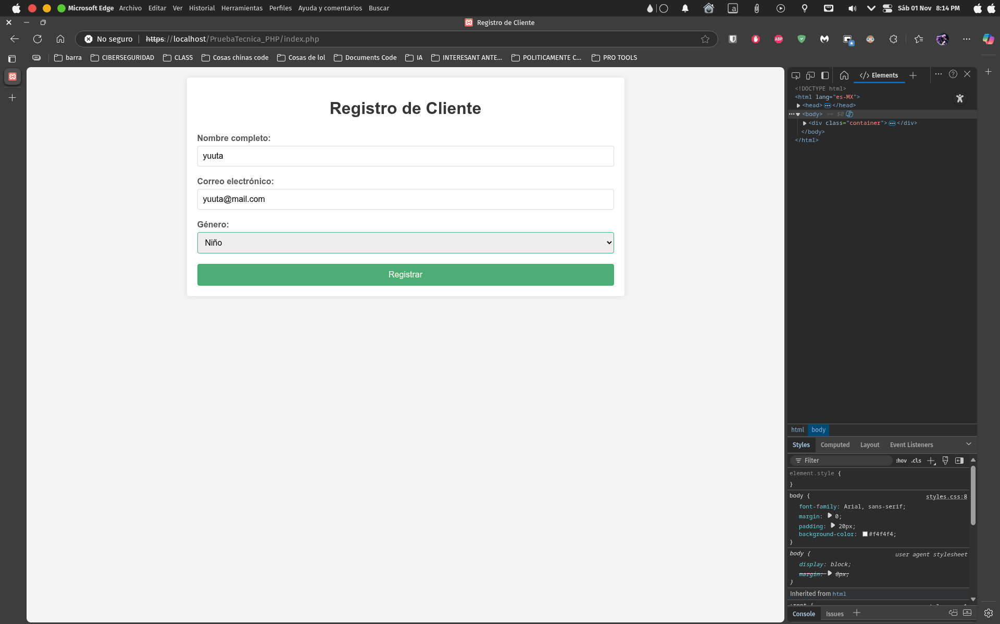
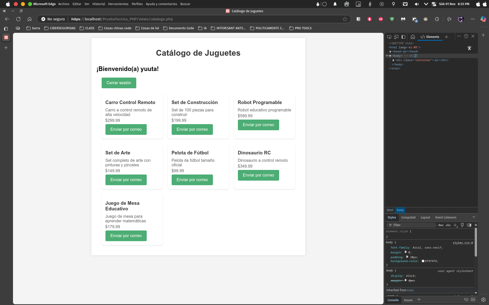
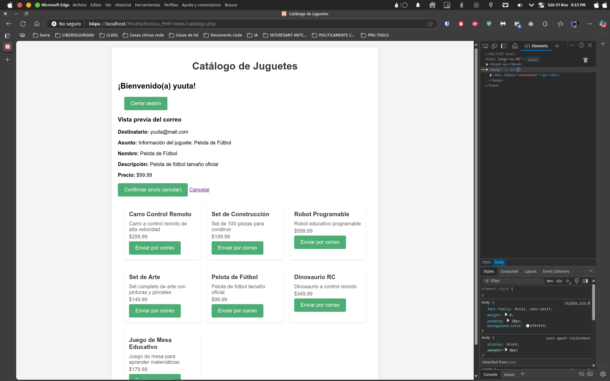
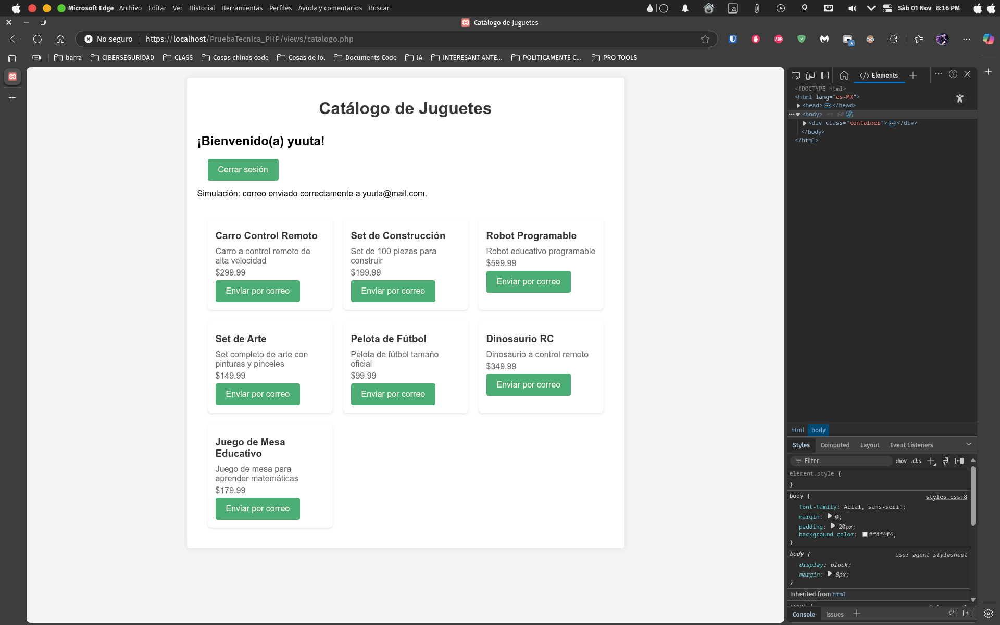

# Tienda de Juguetes (PHP) — Proyecto de ejemplo

Resumen
--------
Proyecto sencillo en PHP que implementa un formulario de registro de cliente y un catálogo de juguetes. Permite:

- Registrar un cliente (nombre, correo, género).
- Mostrar un catálogo filtrado por género (boy, girl).
- Simular el envío de información de un juguete por correo (vista previa y confirmación).

Objetivo: ejemplo instructivo para prácticas de PHP, consultas preparadas (mysqli), gestión de sesiones y manejo básico de vistas.

Estructura del proyecto
----------------------

```
PruebaTecnica_PHP/
├─ assets/
│  └─ img/
├─ css/
│  └─ styles.css
├─ includes/
│  └─ _db.php            # Conexión a la base de datos y session_start()
├─ views/
│  ├─ registro.php       # Formulario de registro
│  ├─ procesar_registro.php # Lógica de procesamiento del registro
│  └─ catalogo.php       # Listado de juguetes y envío simulado
├─ db.sql                # Script para crear BD `juguetes` y tablas de ejemplo
├─ index.php             # Punto de entrada (incluye views/registro.php)
└─ README.md
```

Requisitos
----------

- PHP 7.4+ con extensión mysqli
- Servidor web (o `php -S` para pruebas locales)
- MySQL / MariaDB

Instalación rápida (local)
-------------------------

1. Importar la base de datos de ejemplo:

```bash
mysql -u root -p < db.sql
```

2. Levantar el servidor PHP desde la raíz del proyecto para pruebas:

```bash
php -S localhost:8000 -t .
```

3. Abrir en el navegador:

```
http://localhost:8000/index.php
```

Flujo de la aplicación
----------------------

- `index.php` inicia la sesión y muestra el formulario (`views/registro.php`) si no hay sesión activa.

- El formulario POST a `views/procesar_registro.php` valida los campos y, en caso de éxito, guarda datos en `$_SESSION` y redirige a `views/catalogo.php`.

- En `views/catalogo.php` el usuario puede ver los juguetes aplicando filtro por género y usar la función de envío simulado.
    
    

    

Seguridad y buenas prácticas (resumen)
-------------------------------------

- Se usan sentencias preparadas (`mysqli_prepare`) para evitar inyección SQL.
- Se emplea `htmlspecialchars()` al renderizar datos para evitar XSS.
- Evita mostrar errores de base de datos directamente en producción; registra en logs y muestra mensajes genéricos.

Glosario de variables (todos los includes y vistas)
-------------------------------------------------

A continuación se listan las variables que aparecen en el proyecto, con su significado y dónde se usan.

- $host (includes/_db.php)
  - Host del servidor MySQL. Valor por defecto: `localhost`.

- $user (includes/_db.php)
  - Usuario de la base de datos. Por defecto: `root`.

- $password (includes/_db.php)
  - Contraseña del usuario de la base de datos. Por defecto: cadena vacía.

- $database (includes/_db.php)
  - Nombre de la base de datos a usar. En este proyecto: `juguetes`.

- $conexion (includes/_db.php)
  - Recurso/objeto de conexión devuelto por `mysqli_connect`. Usado en todas las consultas.

- $_SESSION (varias ubicaciones)
  - Variable superglobal que almacena datos de sesión.
  - Claves usadas:
    - `$_SESSION['nombre']`: nombre del cliente registrado (string).
    - `$_SESSION['genero']`: género del cliente (`'boy'` o `'girl'`).
    - `$_SESSION['mail']`: correo del cliente (string), usado para simulación de envío.
    - `$_SESSION['errores']`: array de errores (mensajes) generado por validaciones.

- $_SERVER (varias ubicaciones)
  - Superglobal con información de la petición.
  - `$_SERVER['REQUEST_METHOD']`: método HTTP (GET/POST).

- $_POST (views/registro.php / procesar_registro.php / catalogo.php)
  - Datos enviados en formularios.
  - Campos esperados:
    - `$_POST['name']`: nombre ingresado en el formulario (registro).
    - `$_POST['mail']`: correo ingresado en el formulario (registro).
    - `$_POST['genero']`: género seleccionado en el formulario (registro).
    - `$_POST['logout']`: (catalogo) presencia indica petición de cerrar sesión.
    - `$_POST['send']`: (catalogo) presencia indica solicitud de vista previa de envío.
    - `$_POST['confirm_send']`: (catalogo) presencia indica confirmación de envío simulado.
    - `$_POST['juguete_id']`: (catalogo) id numérico del juguete seleccionado para vista/ envío.

- $nombre (views/procesar_registro.php)
  - Valor procesado del campo `name` (cadena). Se asigna desde `$_POST['name']`.

- $mail (views/procesar_registro.php)
  - Valor procesado del campo `mail` (cadena). Se asigna desde `$_POST['mail']`.

- $genero (views/procesar_registro.php, views/catalogo.php)
  - Valor procesado del campo `genero` (string). Usado para filtrar juguetes y como dato de sesión.

- $errores (views/procesar_registro.php)
  - Array de mensajes de error recopilados durante la validación del registro.

- $query / $q (catalogo.php / procesar_registro.php)
  - Strings con consultas SQL parametrizadas antes de preparar y ejecutar (ej. `INSERT INTO clientes ...` o `SELECT ... FROM juguetes WHERE id = ?`).

- $stmt, $stmt2, $stmt3 (catalogo.php / procesar_registro.php)
  - Variables que contienen el objeto/handle del statement preparado (`mysqli_stmt`) usado para ejecutar consultas seguras.

- $res2, $res3, $resultado (catalogo.php)
  - Resultado devuelto por la ejecución del statement (result set) obtenido con `mysqli_stmt_get_result()`.

- $preview (catalogo.php)
  - Booleano que indica si se está mostrando la vista previa del correo.

- $preview_toy (catalogo.php)
  - Array asociativo con los datos del juguete seleccionado para vista previa (campos: id, nombre, descripcion, precio, imagen).

- $preview_to / $to (catalogo.php)
  - Dirección de correo (string) usada para la simulación, tomada desde `$_SESSION['mail']`.

- $mensaje_envio (catalogo.php)
  - Mensaje informativo que se muestra al usuario (ej. errores de falta de correo en sesión o confirmación de envío simulado).

- $juguete_id (catalogo.php)
  - Identificador numérico del juguete seleccionado. Se obtiene desde `$_POST['juguete_id']` y se valida con `intval()`.

- $j, $juguete (catalogo.php)
  - Filas recuperadas de la tabla `juguetes` (array asociativo) cuando se hace fetch de resultados.

Notas específicas sobre tipos y validaciones
-----------------------------------------

- Se espera que `genero` tome uno de los valores permitidos: `boy`, `girl`.
- `juguete_id` debe convertirse a entero antes de usarlo en consultas para evitar inyección y errores (se usa `intval()`).
- `mail` debe validarse con `filter_var(..., FILTER_VALIDATE_EMAIL)`.

